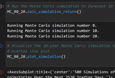
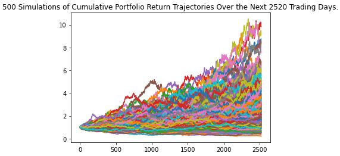
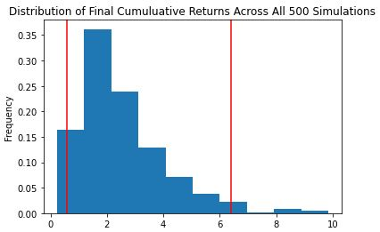
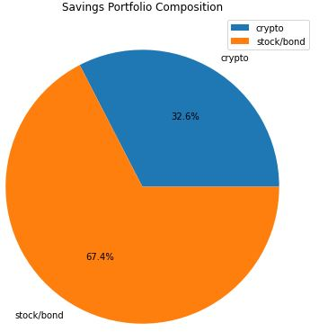

# Module 5 Challenge

In this project a retirement portfolio is analyzed, taking in current prices for the crypto currency portion and up to date API calls for the

stocks and bonds portion.  Monte Carlo simulations are also run to compare the results of the portfolio weighted differently over the course of

10 years and 30 years

---

## Technologies

This project uses Python 3.9.7 and the following libraries - 
| Library | Version | Documentation
|----|----|---|
|requests|2.26.0| [requests docs](https://requests.readthedocs.io/en/latest/)
|alpaca trade api|2.2.0|[alpaca trade api docs](https://github.com/alpacahq/alpaca-trade-api-python)
| pandas |1.4.2| [pandas docs](https://pandas.pydata.org/docs)
| Numpy |1.22| [Numpy docs](https://numpy.org/doc/stable/)

---

## Installation Guide


Libraries can be imported as follows

```
import alpaca_trade_api as tradeapi

import pandas as pd

import numpy as np
```
---

## Usage

Serveral tools were used to help visualize the portfolio in this analysis.


|<p align="center">Monte Carlo Simulation</p>|<p align="center">Cumulative Returns</p>|
|---|---|
|<p align="center"></p>|<p align="center">
|<p align="center">**Cumulative Distribution**</p>|<p align="center">**Savings Portfolio**</p>|
|<p align="center">|<p align="center">|

---
---

## Contributors

Dan McQueen

dandmcqueen@gmail.com

[Linkedin](https://www.linkedin.com/in/dan-mcqueen-4a5980238/)

---

## License

[GNU v3.0](LICENSE)
